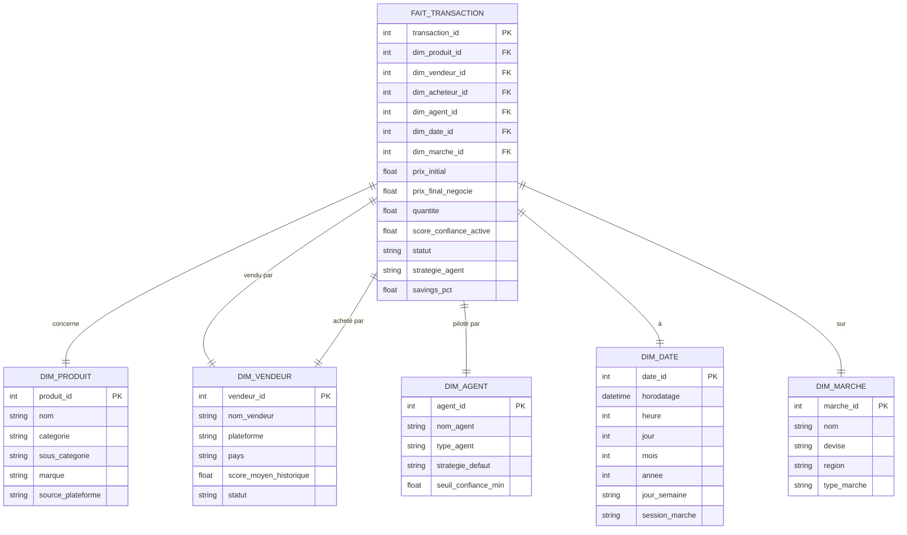
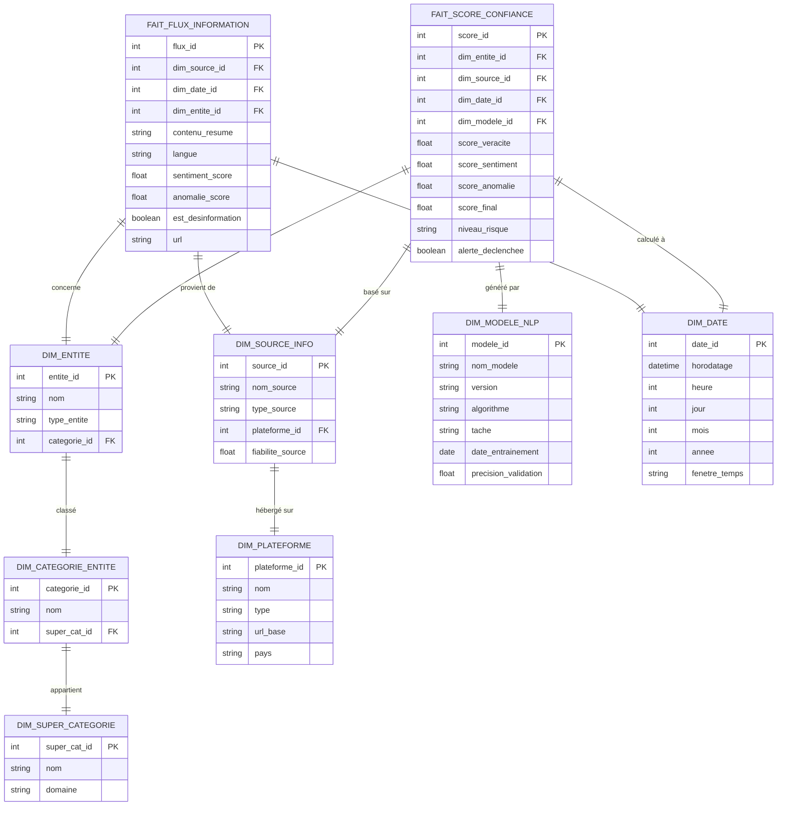
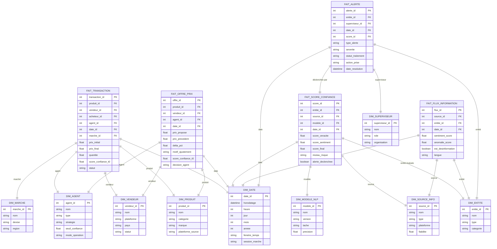

# 🏛️ AuraMarket — Data Warehouse Design

AuraMarket fuses two complex systems: a **Multi-Agent Marketplace** (transactions, dynamic pricing, autonomous agents) and a **Cognitive Engine — L'Oracle** (NLP, disinformation detection, trust scores). The DW must serve both.

---

## 🔍 Key Business Processes → Fact Tables

| Business Process | Fact Table | Grain |
|---|---|---|
| Agent executes a transaction | `FAIT_TRANSACTION` | 1 row = 1 buy/sell |
| Agent places/adjusts price offer | `FAIT_OFFRE_PRIX` | 1 row = 1 price offer event |
| Oracle computes a trust score | `FAIT_SCORE_CONFIANCE` | 1 row = 1 score snapshot |
| Oracle ingests an info item | `FAIT_FLUX_INFORMATION` | 1 row = 1 article/tweet/post |
| Oracle raises an alert | `FAIT_ALERTE` | 1 row = 1 alert event |

---

## Option 1 — ⭐ Star Schema: Transaction Analytics Hub

Focus on the core marketplace — agent transactions and price decisions, with flat dimensions.

> [!TIP]
> **Usage :** Tableaux de bord de volume transactionnel, marge négociée par agent, taux d'exécution par marché.

---

## Option 2 — ❄️ Snowflake Schema: Cognitive Scoring Layer

Models the Oracle's trust score pipeline with normalized hierarchies for sources, semantic content, and temporal analysis.

> [!TIP]
> **Usage :** Évolution du score de confiance d'un vendeur dans le temps, détection de campagnes de désinformation coordonnées, audit d'un modèle NLP.

---

## Option 3 — 🌌 Galaxy / Constellation Schema (Architecture Complète AuraMarket)

The full model — all five fact tables sharing dimensions. This is the **production-grade DW** for AuraMarket.

> [!IMPORTANT]
> **Cette architecture est la cible finale pour AuraMarket.** Elle permet de répondre aux exigences du projet : relier chaque décision d'agent à un score de confiance, tracer l'origine informationnelle de chaque alerte, et fournir un historique complet pour les tableaux de bord superviseurs.

---

## Architecture en Couches (Vue Globale)

```mermaid
graph TD
    subgraph SOURCES["🌐 Sources de Données"]
        A1[Amazon / Jumia / Avito\nJSON Scrapers]
        A2[Twitter / Reddit / Forums\nAPI Streams]
        A3[Sites d'actualités\nRSS / Crawlers]
        A4[Agents MAS\nÉvénements internes]
    end

    subgraph STAGING["📥 Couche Staging (Brut)"]
        B1[STG_PRODUITS]
        B2[STG_FLUX_TEXTE]
        B3[STG_TRANSACTIONS]
        B4[STG_SCORES_NLP]
    end

    subgraph ODS["🔄 ODS — Operational Data Store"]
        C1[Nettoyage & Déduplication]
        C2[Normalisation des prix & monnaies]
        C3[Enrichissement NLP\nSentiment / Anomalie]
        C4[Calcul Score de Confiance]
    end

    subgraph DW["🏛️ Data Warehouse — Schéma en Constellation"]
        D1[FAIT_TRANSACTION]
        D2[FAIT_OFFRE_PRIX]
        D3[FAIT_SCORE_CONFIANCE]
        D4[FAIT_FLUX_INFORMATION]
        D5[FAIT_ALERTE]
        D6[DIM_PRODUIT / DIM_VENDEUR\nDIM_AGENT / DIM_DATE\nDIM_SOURCE / DIM_MARCHE]
    end

    subgraph DM["📊 Data Marts"]
        E1[Mart Superviseurs\nAlertes & Traçabilité]
        E2[Mart Agents\nPerformance & Stratégie]
        E3[Mart Oracle\nScores & Désinformation]
    end

    subgraph VIZ["📈 Reporting & Dashboards"]
        F1[Power BI / Metabase\nTableau de bord temps réel]
        F2[Alertes Automatiques\nEmail / Slack]
    end

    SOURCES --> STAGING
    STAGING --> ODS
    ODS --> DW
    DW --> DM
    DM --> VIZ
```

---

## Métriques Clés par Tableau de Bord

### Pour les Superviseurs
| Métrique | Source |
|---|---|
| Score de confiance moyen par vendeur | `FAIT_SCORE_CONFIANCE` |
| Nombre d'alertes actives / résolues | `FAIT_ALERTE` |
| Historique des contenus suspects | `FAIT_FLUX_INFORMATION` |
| Décisions d'agents influencées par Oracle | `FAIT_TRANSACTION.score_confiance_t0` |

### Pour les Agents
| Métrique | Source |
|---|---|
| Volume de transactions par agent | `FAIT_TRANSACTION` |
| Prix moyen négocié vs prix initial | `FAIT_OFFRE_PRIX` |
| Taux de suspension (score trop bas) | `FAIT_OFFRE_PRIX.decision_agent` |
| Économies générées par Dynamic Pricing | `FAIT_OFFRE_PRIX.delta_pct` |

### Pour L'Oracle
| Métrique | Source |
|---|---|
| Distribution des scores de sentiment | `FAIT_FLUX_INFORMATION` |
| Précision des modèles NLP | `DIM_MODELE_NLP` |
| Détection de campagnes coordonnées | `FAIT_FLUX_INFORMATION.est_desinformation` |
| Évolution du score d'une marque dans le temps | `FAIT_SCORE_CONFIANCE` (time-series) |

---

## ✅ Recommandation Finale

> [!IMPORTANT]
> Adoptez l'**Option 3 — Architecture Galaxy** comme modèle cible. Ce n'est pas seulement un choix académique : la séparation en 5 tables de faits reflète exactement les 5 processus métiers d'AuraMarket. La dimension `DIM_DATE` avec `horodatage` (datetime) supporte l'analyse en temps quasi-réel. Implémentez d'abord `FAIT_TRANSACTION` + `FAIT_SCORE_CONFIANCE` pour votre MVP, puis ajoutez les autres tables progressivement via votre pipeline Pentaho/Talend.
