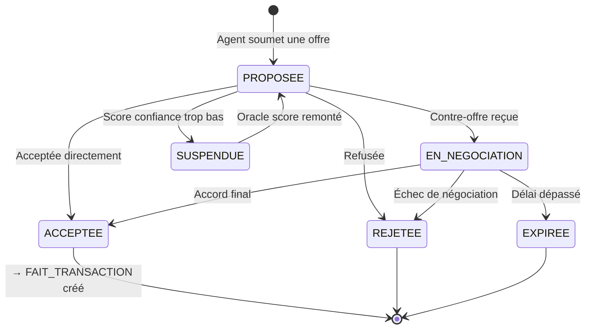
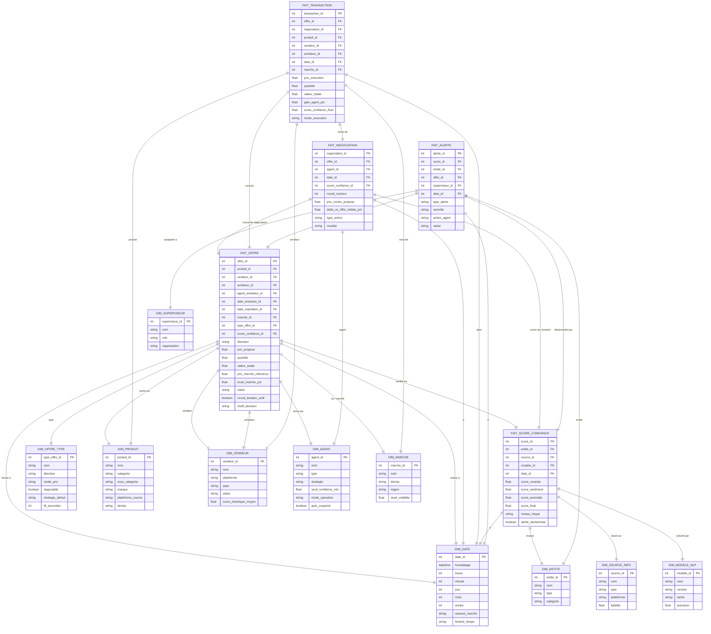
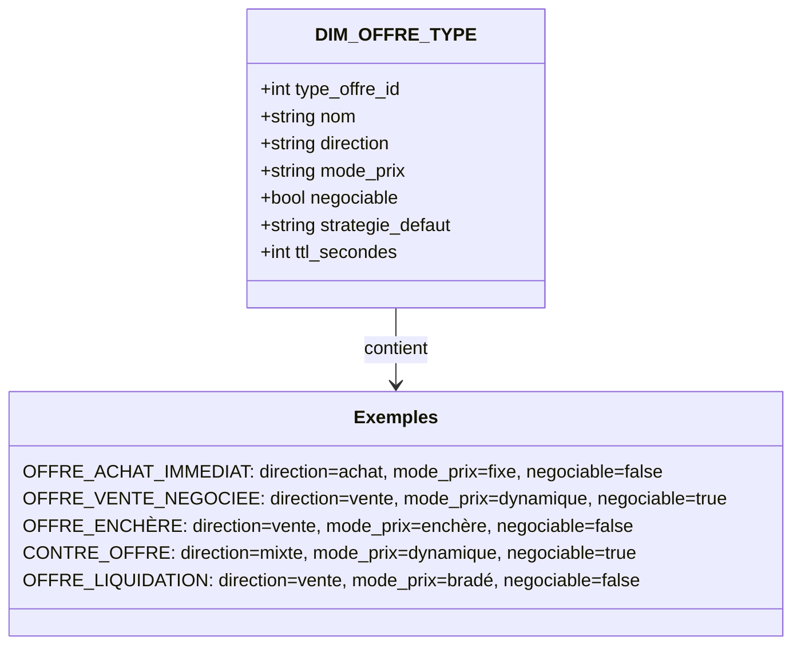
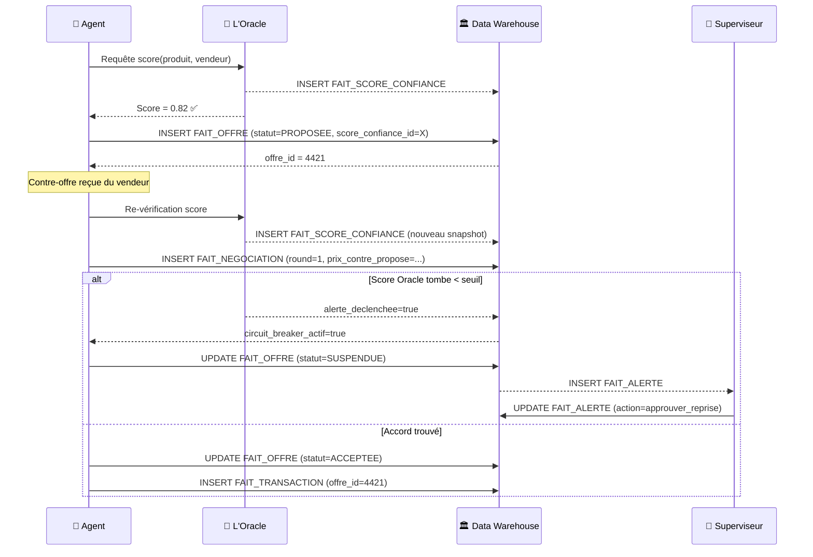
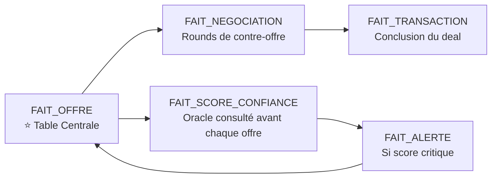

# 🏛️ AuraMarket DW — Modèle Centré sur les Offres

> [!IMPORTANT]
> Dans AuraMarket, **l'offre est l'événement atomique fondamental**. Toute transaction naît d'une offre. Tout ajustement de prix est une nouvelle offre. La confiance de L'Oracle est consultée **avant** de soumettre une offre. Ce modèle place `FAIT_OFFRE` au cœur du DW.

---

## Le Cycle de Vie d'une Offre

---

## Architecture Galaxy — L'Offre comme Centre de Gravité

---

## Zoom sur la Dimension `DIM_OFFRE_TYPE`

Cette dimension est la clé de voûte de la flexibilité du système. Elle définit le comportement attendu de chaque type d'offre.

---

## Flux de Données par Processus Offre

---

## Métriques Prioritaires — Tableau de Bord Offres

| Métrique | Calcul SQL simplifié | Valeur métier |
|---|---|---|
| **Taux d'acceptation des offres** | `COUNT(statut=ACCEPTEE) / COUNT(*)` | Performance des agents |
| **Délai moyen de négociation** | `AVG(date_transaction - date_offre)` | Efficacité du marché |
| **Écart prix négocié vs marché** | `AVG(ecart_marche_pct)` | Qualité du dynamic pricing |
| **Offres suspendues par Oracle** | `COUNT(circuit_breaker_actif=true)` | Impact sécurité cognitive |
| **Rounds de négociation moyens** | `AVG(round_numero) par offre` | Complexité des deals |
| **Valeur totale des offres actives** | `SUM(valeur_totale) WHERE statut=PROPOSEE` | Exposition du marché |
| **Taux de conversion offre→transaction** | `COUNT(FAIT_TRANSACTION) / COUNT(FAIT_OFFRE)` | KPI central |

---

## ✅ Résumé de la Hiérarchie des Faits

> [!IMPORTANT]
> L'offre est la **source de vérité**. Une transaction n'est que le résultat d'une offre acceptée. Un score de confiance n'existe que parce qu'une offre va être émise. Une alerte ne se déclenche que si cette offre est en danger. Tout converge vers et depuis `FAIT_OFFRE`.
