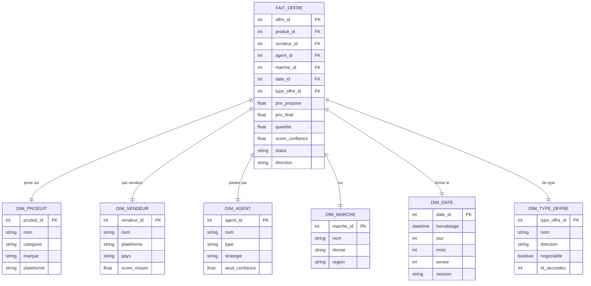
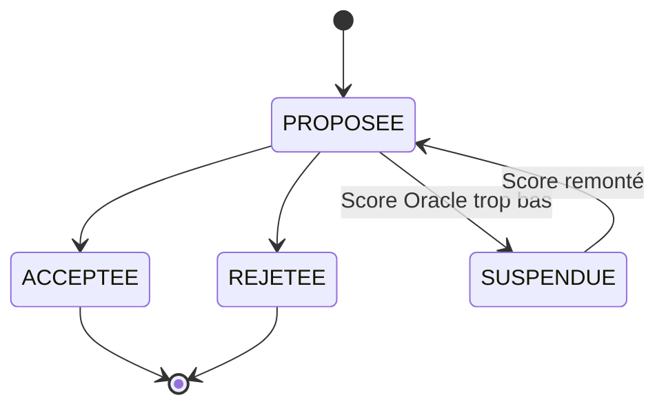

# AuraMarket — Schéma Simplifié (Star Schema)

## Schéma en Étoile — Centré sur les Offres

---

## Statuts possibles d'une offre

---

## Métriques principales

| Métrique | Description |
|---|---|
| `score_confiance` | Score Oracle au moment de l'offre |
| `prix_final / prix_propose` | Taux de négociation |
| `statut` | Taux conversion offre → acceptée |
| `direction` | Ratio achat / vente par agent |
