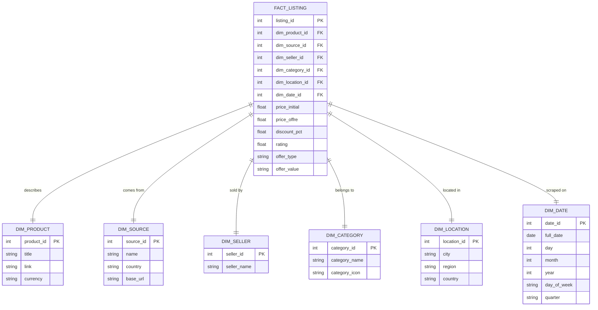
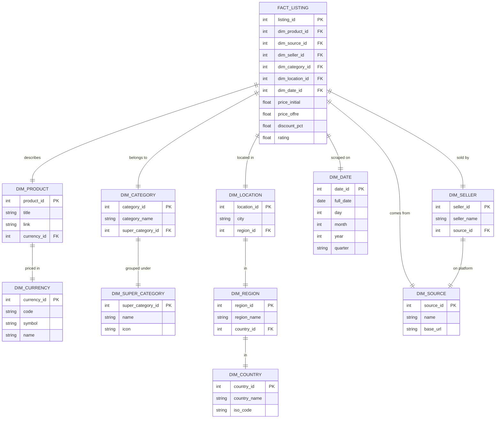
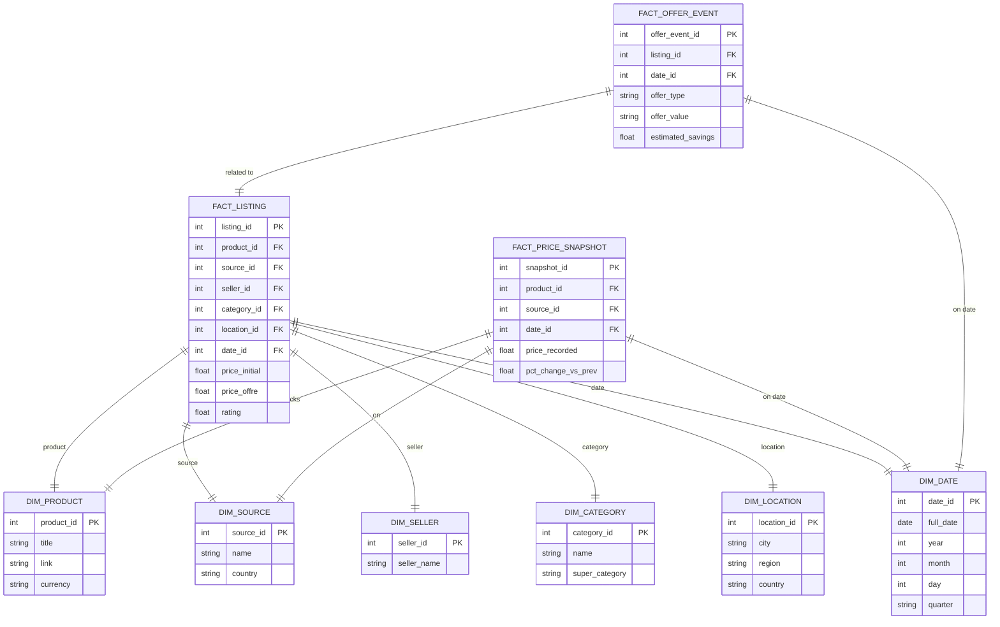

# 🏛️ Data Warehouse Models — E-Commerce Aggregator

Based on your scraping project (Amazon · Jumia · Avito), here are **3 DW model suggestions**, going from simple to advanced.

---

## Your Source Data at a Glance

| Field | Amazon | Jumia | Avito |
|---|---|---|---|
| `title` | ✅ | ✅ | ✅ |
| `price_initial` | ✅ | ✅ | ✅ |
| `price_offre` | ✅ | ✅ | ✅ |
| `seller` | ✅ | ✅ | ✅ |
| `location` | ✅ | ✅ | ✅ |
| `category` | ✅ | ✅ | ❌ (from link) |
| `rating` | ✅ | ✅ | ❌ |
| `offre` (deal detail) | ✅ | ✅ | ❌ |
| `date` | ✅ | ✅ | ✅ |
| `link` | ✅ | ✅ | ✅ |

---

## Option 1 — ⭐ Star Schema (Simple, Recommended for Beginners)

The classic DW pattern. One central **fact table** surrounded by flat **dimension tables**.



> [!TIP]
> **Best for:** Simple reporting (avg price per category, listings per source, best sellers). Easy to query with SQL. Great for tools like Power BI / Tableau.

---

## Option 2 — ❄️ Snowflake Schema (Normalized, Cleaner)

Extends the star by normalizing dimensions that have their own hierarchy. For example, `Location → Region → Country`.



> [!TIP]
> **Best for:** Data integrity and storage efficiency. Reduces redundancy (e.g., "Casablanca" is stored once). Slightly slower queries because of more JOINs.

---

## Option 3 — 🌌 Galaxy / Constellation Schema (Advanced, Multi-Fact)

The most powerful model. Multiple fact tables share dimensions. Split by business process: **listings**, **price changes over time**, and **deal/offer events**.



> [!TIP]
> **Best for:** Advanced analytics — tracking price evolution over time, deal frequency analysis, cross-platform price comparisons. Suitable for a full BI dashboard with a proper ETL pipeline (Pentaho/Talend).

---

## Comparison Table

| | ⭐ Star | ❄️ Snowflake | 🌌 Galaxy |
|---|---|---|---|
| **Complexity** | Low | Medium | High |
| **Query speed** | Fast | Medium | Fast (fact-to-fact) |
| **Storage efficiency** | Low | High | Medium |
| **Redundancy** | High | Low | Low |
| **Best BI tool fit** | Power BI, Tableau | SQL-heavy tools | Pentaho, Talend |
| **Good for your PFA?** | ✅ Yes | ✅ Yes | ⚠️ Advanced |

---

## ✅ My Recommendation

> [!IMPORTANT]
> For your PFA, go with **Option 2 (Snowflake Schema)**. It shows academic rigor (normalization, hierarchy levels), maps perfectly to your Pentaho ETL lab, and is straightforward to implement. Use the `DIM_DATE` table to enable time-series analysis per scraping run, and add a `FACT_PRICE_SNAPSHOT` from Option 3 if you want to showcase price tracking as a bonus feature.

### Suggested ETL Flow (Pentaho)
```
JSON Files (Avito, Jumia, Amazon)
        ↓
  [Extract] JSON Input Step
        ↓
  [Transform] Field normalizer + Type conversion + Lookup / Surrogate key
        ↓
  [Load] Dimension Tables first → then FACT_LISTING
        ↓
  DW (MySQL / PostgreSQL)
        ↓
  Reporting Layer (Power BI / Metabase)
```
